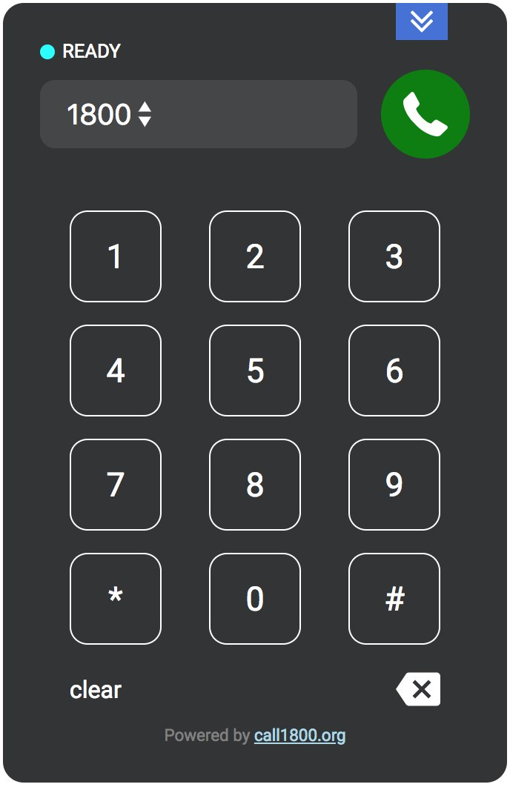

<p align="center"><a href="https://call1800.org/" target="_blank"></a></p>
<p align="center"><a href="https://badge.fury.io/js/call1800"></a></p>

call1800 is an embeddable element that allows your users make calls to 1800 numbers completely free.

<p align="center"><a href="https://call1800.org/" target="_blank"></a></p>

## Installation

### via NPM (recommended)
```bash
npm install call1800
```

### via CDN
```html
<link rel="stylesheet" href="<ADD_LINK_HERE>">
<script src="<ADD_LINK_HERE>"></script>
```

## Usage

### Quick start

1. Add `dist/main.css` to your styles.

2. Initialize dialpad with Javascript.
```javascript
import Dialpad from 'call1800'; // if you used CDN Dialpad class is available at window.Dialpad

const dialpad = new Dialpad();
dialpad.render();
```

### Available methods
#### `new Dialpad(options)`
Creates dialpad instance with options object. You can omit `options` if defaults
values are suitable for your use case.

Available options:

| Option | Description | Default value | Data type |
| :----: | :---------: | :-----------: | :-------: |
|closed|Changes initial state of the dialpad. If true - dialpad will be collapsed by default|false|Boolean|

Example:

```javascript
const dialpad = new Dialpad({
  closed: true,
});
```

#### `dialpad.render()`
Renders dialpad on page.

#### `dialpad.call(number)`
Starts a call to `number`. `number` must be a String that starts with 18xx and
exactly 11 characters long.

#### `dialpad.hangUp()`
Stops active call.

#### `dialpad.toggle()`
Collapse or open dialpad.

#### `dialpad.open()`
Opens dialpad.

#### `dialpad.close()`
Collapses dialpad.
